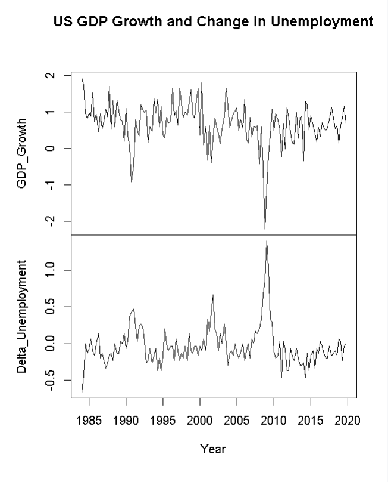
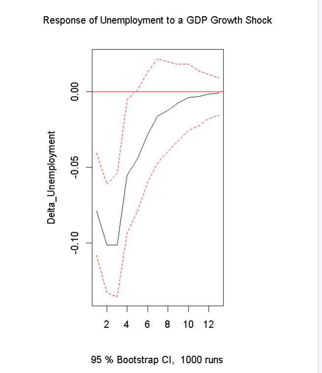
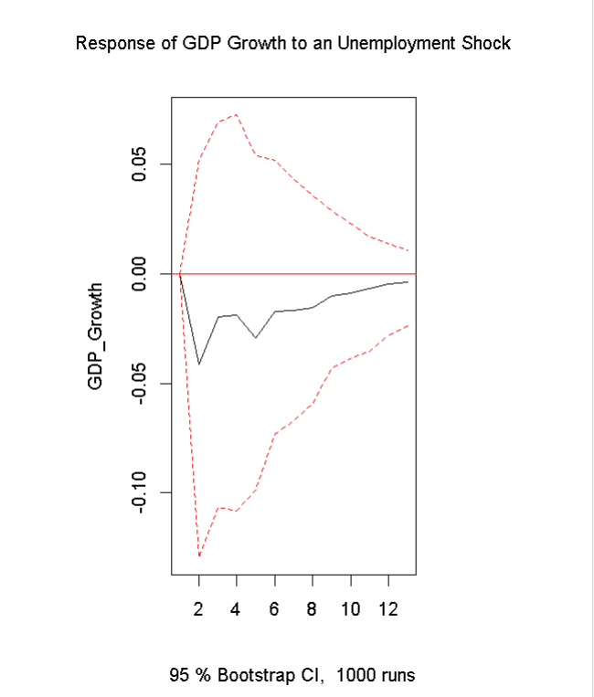
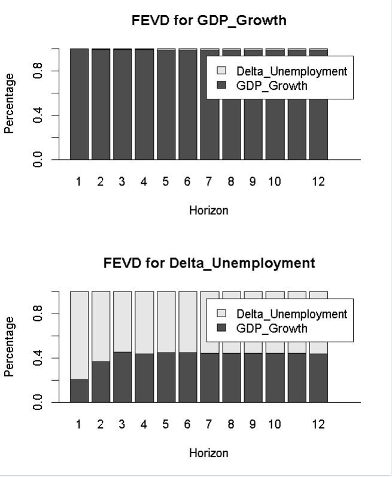
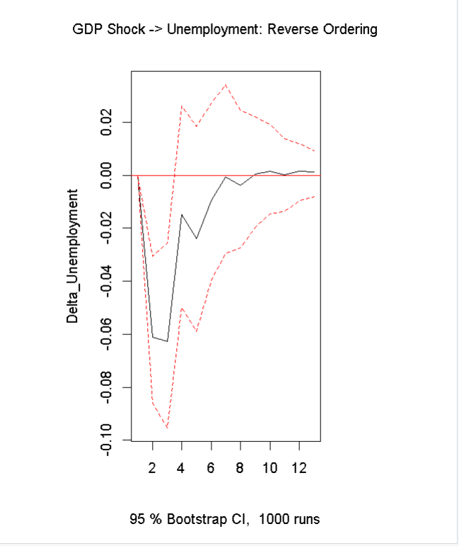
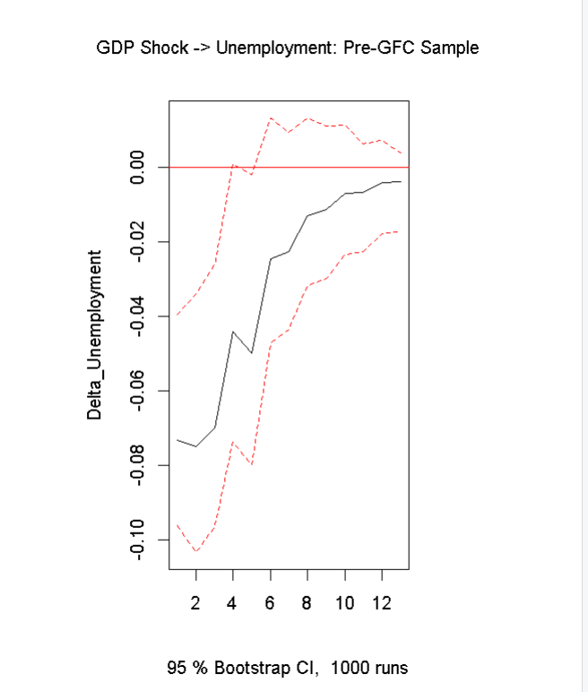

# Output Growth and Unemployment Dynamics in the United States
### A Bivariate VAR Test of Okun's Law, 1984Q1–2019Q4

A time-series investigation into the dynamic relationship between real GDP growth and changes in unemployment — using a bivariate VAR to test whether the negative co-movement predicted by Okun's Law is a genuine, temporally-ordered dynamic relationship rather than a purely contemporaneous correlation.

## Author

| | |
|---|---|
| Name | Sameer Chawla |
| Programme | MSc Economics |
| Institution | Gokhale Institute of Politics and Economics (GIPE), Pune |
| Expected Graduation | 2027 |

## Table of Contents

1. [Project Overview](#1-project-overview)
2. [Research Question & Empirical Strategy](#2-research-question--empirical-strategy)
3. [Data & Variable Construction](#3-data--variable-construction)
4. [Methodological Pipeline](#4-methodological-pipeline)
5. [Key Results](#5-key-results)
6. [Methodological Caveats & Limitations](#6-methodological-caveats--limitations)
7. [How to Run](#7-how-to-run)
8. [References](#8-references)

## 1. Project Overview

Okun's Law is conventionally estimated as a single static regression of unemployment (or its change) on output growth. This treats the relationship as one-directional and contemporaneous by construction, which forecloses two questions that matter for both theory and policy: does output growth *lead* unemployment, does unemployment feed back onto growth, and how long do these effects persist?

This project instead models the joint dynamics of **GDP growth** and the **change in the unemployment rate** as a bivariate Vector Autoregression (VAR). The VAR framework treats both series as endogenous, recovers the full dynamic response of each variable to a shock in the other via impulse response functions, decomposes forecast error variance, and tests the direction of causality formally (Granger, 1969) rather than assuming it.

*Working research question (to be refined):* does the inverse Okun relationship hold as a genuine dynamic, temporally-ordered pattern in the US data — i.e., does a GDP growth shock Granger-cause a fall in unemployment, is the reverse channel absent, and is this pattern stable across sub-samples and identification orderings?

## 2. Research Question & Empirical Strategy

### Research Question

**Do changes in U.S. real GDP growth systematically precede changes in unemployment, and how persistent is this relationship?**

The analysis uses a **bivariate Vector Autoregression (VAR)** in which both GDP growth and the change in unemployment are treated as endogenous variables.

### Empirical Model

The reduced-form VAR(p) can be written as:

```text
Y_t = c + A1 Y_(t-1) + A2 Y_(t-2) + ... + Ap Y_(t-p) + e_t
```

where:

```text
Y_t = [ GDP_Growth_t , Delta_Unemployment_t ]'
```

The two estimating equations are:

```text
GDP_Growth_t =
    c1
    + Σ ai * GDP_Growth_(t-i)
    + Σ bi * Delta_Unemployment_(t-i)
    + e1_t
```

and

```text
Delta_Unemployment_t =
    c2
    + Σ gi * GDP_Growth_(t-i)
    + Σ di * Delta_Unemployment_(t-i)
    + e2_t
```

for `i = 1, ..., p`.

`c1` and `c2` are constants, while the coefficients capture the dynamic effects of lagged GDP growth and lagged changes in unemployment.

### Identification

Orthogonalised impulse-response functions are obtained using a **Cholesky decomposition**.

The baseline ordering is:

```text
GDP_Growth  ->  Delta_Unemployment
```

This assumes that a GDP-growth innovation may affect unemployment within the same quarter, while an unemployment innovation affects GDP growth only with a lag.

This is an **identifying assumption rather than an empirical fact**, so the model is also estimated under the reverse ordering as a robustness check.

### Variables

| Variable | Construction | Order of Integration |
|---|---|---:|
| `GDP_Growth` | 100 × quarterly log-difference of real GDP (`GDPC1`) | I(0) |
| `Delta_Unemployment` | First difference of the quarterly-average unemployment rate (`UNRATE`) | I(0) |

ADF and KPSS tests provide evidence that both transformed variables are stationary, allowing estimation of a conventional stationary VAR without a VECM.

## 3. Data & Variable Construction

**Source:** FRED (Federal Reserve Economic Data), retrieved via the `quantmod` R package.

**Series:** `GDPC1` (Real Gross Domestic Product, quarterly) and `UNRATE` (Civilian Unemployment Rate, monthly, aggregated to quarterly averages).

**Sample:** 1984Q1–2019Q4 (144 quarterly observations). The sample is deliberately truncated at 2019Q4 to exclude the COVID-19 shock, whose magnitude (unemployment +10pp, GDP −9% in a single quarter) would dominate the covariance structure and distort a linear VAR estimated on 36 years of otherwise moderate fluctuations. The 1984 start post-dates the Volcker disinflation and coincides with the conventional start of the "Great Moderation."

**Transformations:**
- $\text{GDP\_Growth}_t = 100 \times \big(\ln \text{GDP}_t - \ln \text{GDP}_{t-1}\big)$
- $\Delta\text{Unemployment}_t = \text{UNRATE}_t - \text{UNRATE}_{t-1}$

Both transformations are the standard stationarity-inducing operations for these series (log GDP and the unemployment rate are both well known to contain a unit root in levels); ADF and KPSS tests on the transformed series (§4, Stage 1) confirm stationarity is achieved.

| Variable | Mean | SD | Min | Max |
|---|---|---|---|---|
| GDP_Growth | 0.680 | 0.572 | −2.213 | 1.936 |
| Delta_Unemployment | −0.034 | 0.269 | −0.667 | 1.400 |



## 4. Methodological Pipeline

```
┌─────────────────────────────────────────────────────────────────┐
│  STAGE 1 │ Unit Root Testing                                     │
│           ADF (drift) + KPSS (long-lag) on both series           │
│           → Both series I(0) → No differencing/cointegration     │
│             analysis required                                    │
├─────────────────────────────────────────────────────────────────┤
│  STAGE 2 │ Lag Order Selection                                   │
│           VARselect (AIC/HQ/SC/FPE) → SC(n) = 1                  │
│           Breusch-Godfrey LM test on VAR(1) residuals rejects    │
│           white noise → lag order increased sequentially until   │
│           residual autocorrelation clears → VAR(4)                │
├─────────────────────────────────────────────────────────────────┤
│  STAGE 3 │ Estimation & Diagnostics                               │
│           VAR(4), const → Breusch-Godfrey, Jarque-Bera, ARCH-LM  │
├─────────────────────────────────────────────────────────────────┤
│  STAGE 4 │ Stability                                              │
│           Companion-matrix roots + OLS-CUSUM                     │
├─────────────────────────────────────────────────────────────────┤
│  STAGE 5 │ Causality                                              │
│           Bootstrapped Granger causality (both directions) +      │
│           instantaneous causality test                            │
├─────────────────────────────────────────────────────────────────┤
│  STAGE 6 │ Dynamic Analysis                                       │
│           Orthogonalised IRFs (Cholesky) + FEVD, 95% bootstrap CI│
├─────────────────────────────────────────────────────────────────┤
│  STAGE 7 │ Robustness                                             │
│           Reverse Cholesky ordering, pre-GFC subsample,           │
│           GFC impulse dummies, lag-sensitivity of the headline IRF│
└─────────────────────────────────────────────────────────────────┘
```

**Stage 1 — Unit Root Testing.** The Augmented Dickey-Fuller test (drift, AIC-selected lags) rejects a unit root in GDP_Growth (τ = −5.206, 5% crit. = −2.88) and in Delta_Unemployment (τ = −3.906, 5% crit. = −2.88). The KPSS test at long lags fails to reject stationarity for both series (0.349 and 0.083 respectively, against a 5% critical value of 0.463). GDP_Growth's KPSS statistic is borderline at short lags (0.486 > 0.463 critical value), but this is consistent with well-documented KPSS over-rejection at low lag truncation and is resolved once the long-lag (Schwert-rule) bandwidth is used. Both series are treated as I(0), which is expected given that growth rates and first-differenced rates are the standard stationary transformations of I(1) levels.

**Stage 2 — Lag Order Selection.** Information criteria disagree: SC/HQ select 1 lag, AIC/FPE select 3. The Breusch-Godfrey LM test (8 lags) on the VAR(1) residuals rejects the null of no serial correlation (p = 0.013), so the parsimonious SC-selected specification is rejected in favour of the shortest lag order that passes the diagnostic. Sequential re-estimation shows the test does not clear at p = 2 or p = 3, and passes at **p = 4** (p = 0.104).

**Stage 3 — Estimation & Diagnostics.** The final VAR(4) passes the Breusch-Godfrey test but fails multivariate normality (Jarque-Bera) and the multivariate ARCH-LM test for residual heteroskedasticity — see §6 for the implications.

**Stage 4 — Stability.** The largest companion-matrix root has modulus 0.706, well inside the unit circle; the VAR is dynamically stable. The OLS-CUSUM statistic for both equations remains within the 5% confidence bounds throughout the sample, indicating no evidence of parameter instability.

**Stage 5 — Causality.** A bootstrapped Granger causality test (1,000 replications) is used given the non-normal residuals from Stage 3, which invalidate the asymptotic F-distribution.

**Stage 6 — Dynamic Analysis.** Structural shocks are identified via Cholesky decomposition under the baseline ordering; responses and their 95% bootstrap confidence bands are computed over a 12-quarter horizon.

**Stage 7 — Robustness.** The baseline ordering, full-sample window, and specification are stress-tested against three alternatives (see §5).

## 5. Key Results

### 5.1 Granger and Instantaneous Causality

| Hypothesis | F-stat | Bootstrap p-value | Verdict |
|---|---|---|---|
| GDP_Growth does not Granger-cause Δ Unemployment | 6.164 | 0.023 | **Rejected** |
| Δ Unemployment does not Granger-cause GDP_Growth | 0.282 | 0.863 | Not rejected |
| No instantaneous causality (contemporaneous) | χ² = 23.79 | < 0.001 | **Rejected** |

The causal ordering runs **one way**: GDP growth Granger-causes changes in unemployment, but not the reverse. There is also strong contemporaneous (same-quarter) co-movement, consistent with Okun's Law's traditionally-reported near-instantaneous correlation. This asymmetric, output-leads-unemployment pattern is the paper's central finding.

### 5.2 Impulse Responses

A one-standard-deviation positive GDP growth shock produces a **negative, persistent** response in Δ Unemployment: the response bottoms out around quarters 2–4 and the 95% bootstrap band excludes zero over roughly that window, before decaying back toward zero by quarter ~8 (Fig. 2). The reverse experiment — a positive unemployment-change shock — produces a negative response in GDP growth of similar shape and persistence (Fig. 3), which is unsurprising given the strong contemporaneous correlation documented above, but is not supported as a *directional* (Granger) effect once lead-lag ordering is imposed.




### 5.3 Forecast Error Variance Decomposition

| Response | Horizon | Own shock | Other shock |
|---|---|---|---|
| GDP_Growth | 1 | 100.0% | 0.0% |
| GDP_Growth | 12 | ~98.7% | ~1.3% |
| Δ Unemployment | 1 | 79.5% | 20.5% |
| Δ Unemployment | 12 | ~55.8% | ~44.2% |

GDP growth is almost entirely self-driven at all horizons — unemployment shocks explain a negligible share of its forecast error variance. Δ Unemployment, in contrast, is increasingly explained by GDP growth shocks as the horizon lengthens, rising from ~20% on impact to ~44% at 3 years. This asymmetry mirrors the Granger causality result: growth shocks propagate into unemployment, not the other way around.



### 5.4 Robustness

| Specification | BG (serial corr.) p | JB (normality) p | ARCH-LM p |
|---|---|---|---|
| Baseline VAR(4), full sample | 0.104 | < 0.001 | < 0.001 |
| Reverse Cholesky ordering | 0.104 | < 0.001 | < 0.001 |
| **Pre-GFC subsample (1984Q1–2007Q4)** | **0.295** | **0.307** | **0.400** |
| GFC impulse dummies (full sample) | 0.030 | 0.341 | 0.254 |

- **Reverse ordering:** identifying shocks with unemployment placed first leaves the sign, rough magnitude, and persistence of the GDP → unemployment response unchanged (Fig. 6), so the headline result is not an artefact of the Cholesky ordering choice.
- **Pre-GFC subsample:** restricting the sample to 1984Q1–2007Q4 (N = 92) produces a VAR that **passes all three diagnostic tests simultaneously** — the residual non-normality and ARCH effects in the full-sample model are concentrated in the 2008–09 crisis window, not a generic misspecification. The IRF shape is preserved (Fig. 7).
- **GFC impulse dummies:** adding 2008Q4/2009Q1 dummies to the full sample restores normal, homoskedastic residuals (JB p = 0.341, ARCH p = 0.254) but does **not** fully clear serial correlation (BG p = 0.030), so the dummy-augmented model is reported as a partial, not complete, fix.
- **Lag sensitivity:** the sign and approximate magnitude of the headline GDP → unemployment impulse response is stable across VAR(1) through VAR(4) (trough in the range −0.08 to −0.10 within the first two quarters), indicating the result is not an artefact of the specific lag order chosen in Stage 2.




## 6. Methodological Caveats & Limitations

**6.1 Non-normal, conditionally heteroskedastic residuals in the full sample.** The baseline VAR(4) fails both the Jarque-Bera and ARCH-LM tests. As shown in §5.4, this is driven by the 2008–09 financial crisis: the pre-GFC subsample passes both tests cleanly, and the GFC-dummy model resolves the higher-moment failures without resolving serial correlation. OLS coefficient estimates remain consistent under non-normality, but the reported IRF confidence bands (constructed via a standard residual bootstrap) should be read as approximate rather than exact for the full-sample model. A GARCH-in-VAR or Markov-switching specification would be the natural extension if the crisis period is to be retained and modelled explicitly rather than excluded or dummied out.

**6.2 Residual serial correlation is not fully eliminated.** Even at the maximum lag order tested (p = 4, the point at which the Breusch-Godfrey test first fails to reject at 8 lags), the Portmanteau test at longer lag lengths remains marginally significant in some specifications (e.g. crisis-dummy model, p = 0.021 at 16 lags). This suggests either a lag order beyond the tested range (LAG_MAX = 6) or a source of misspecification the linear VAR does not capture — most plausibly the crisis-period nonlinearity discussed above.

**6.3 Two-variable information set.** A bivariate VAR omits variables long argued to matter for the growth-unemployment nexus — labour force participation, productivity growth, and monetary/fiscal policy indicators in particular. Omitted-variable bias in a VAR context manifests as contamination of both the estimated dynamics and, more importantly, the structural identification: if a third variable drives both series, the two-variable Cholesky ordering used here cannot separate that common driver from genuine bilateral transmission. A three- or four-variable extension (e.g. adding the Federal Funds Rate or labour productivity) is the most direct robustness check against this concern.

**6.4 Identification rests on a recursive (Cholesky) restriction.** The baseline ordering assumes GDP growth shocks can affect unemployment within the same quarter but not vice versa. This is economically defensible (output responds to labour-market slack with a lag, whereas the unemployment rate is measured from a survey taken partway through the quarter and can react faster to output news) but is an assumption, not a test. §5.4 shows the qualitative result survives reversing the ordering, which is reassuring but not equivalent to a fully agnostic identification scheme such as sign restrictions.

**6.5 Sample exclusion of 2020 onward.** Truncating the sample at 2019Q4 avoids the COVID-19 outlier dominating the covariance structure, but it means the model says nothing about whether the estimated Okun relationship held during or after that shock. Extending the sample with either an additional impulse dummy for 2020Q2 or explicit outlier-robust estimation (as used in the companion FRED-based VAR script for INDPRO/CPI/PPI/FEDFUNDS in this repository) is a natural next step.

## 7. How to Run

**Requirements**
- R version ≥ 4.5.0
- Packages: `quantmod`, `zoo`, `urca`, `vars` (installed automatically if missing)
- Active internet connection (required to query the FRED API)

**Execution**
```r
source("Okun_Law_Bivariate_VAR.R")
```
The script will:
1. Fetch `GDPC1` and `UNRATE` from FRED and construct the bivariate series
2. Run unit root tests, lag selection, and estimate the VAR(4)
3. Run the full diagnostic battery (serial correlation, normality, ARCH, stability)
4. Compute Granger causality, IRFs (1,000 bootstrap replications), and FEVD
5. Run all robustness checks (reverse ordering, pre-GFC subsample, GFC dummies, lag sensitivity)
6. Save all tables (`.csv`) and figures (`.png`) to the `output/` folder

**Runtime note:** the bootstrap IRF and Granger causality routines (1,000 replications each) are the slowest steps; reduce `IRF_RUNS` at the top of the script for a faster test run.

## 8. References

Breusch, T.S. (1978). Testing for autocorrelation in dynamic linear models. *Australian Economic Papers*, 17(31), 334–355.

Dickey, D.A., & Fuller, W.A. (1979). Distribution of the estimators for autoregressive time series with a unit root. *Journal of the American Statistical Association*, 74(366a), 427–431.

Engle, R.F. (1982). Autoregressive conditional heteroscedasticity with estimates of the variance of United Kingdom inflation. *Econometrica*, 50(4), 987–1007.

Granger, C.W.J. (1969). Investigating causal relations by econometric models and cross-spectral methods. *Econometrica*, 37(3), 424–438.

Kwiatkowski, D., Phillips, P.C.B., Schmidt, P., & Shin, Y. (1992). Testing the null hypothesis of stationarity against the alternative of a unit root. *Journal of Econometrics*, 54(1–3), 159–178.

Lütkepohl, H. (2005). *New Introduction to Multiple Time Series Analysis*. Springer.

Okun, A.M. (1962). Potential GNP: its measurement and significance. *Proceedings of the Business and Economic Statistics Section, American Statistical Association*, 98–104.

Sims, C.A. (1980). Macroeconomics and reality. *Econometrica*, 48(1), 1–48.

---
MSc Economics · Gokhale Institute of Politics and Economics · Pune, India
